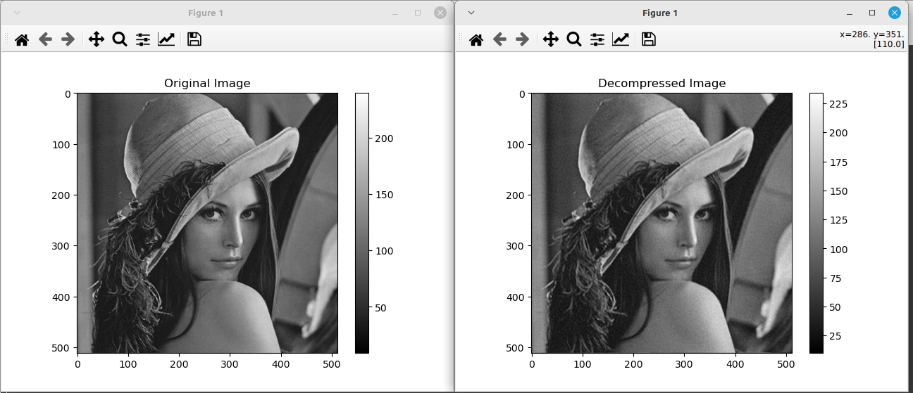

# FFT Signal processor and Image Compressor
This is my own implementation of the FFT algorithm and a built-in application of it as an image compressor.
## Build and installation
The program only depends on the C++ standard libraries and it comes with a makefile to build it.
Command to build it:
```bash
make
```
## How to use it.
### Image Compression
The package comes with a python script which converts images to the format the application uses.
```bash
./tests/scripts/generate_raw.py input_image.jpg generated_image.img
```
To compress the image use the following command.
```bash
./fft -c generated_image.img
```
The command will generate the file with the compressed image (compressed\_image.imgc).
You can also can choose the percentage of coefficients to keep during the compression stage with the -p option.
```bash
# This will keep 1% of the FFT Coefficients in the compressed image
./fft -p 1 -c generated_image.img
```
The default percentage is 10% if not specified.
### Image decompression.
```bash
./fft -d compressed_image.img
```
The command will generate the file with the decompressed image (decompressed\_image.imgc) in the same format as the input image.
### show images
To show either the original image or the decompressed image a python script is included.
```bash
./tests/scripts/show_image.py image.img
```
### Decompression example

### FFT on regular signals.
To use the program to perform the FFT or the iFFT operations, use the program with the -f (forward FFT) and -i (inverse FFT) arguments.
The input to these modes is via the standard input.
```bash
./fft -f
```
or
```bash
./fft -i
```
The next steps is input the size of the signal (it must be a power of two) and the a pair of complex coefficcients which form the input signal.
For example an eight coefficients rectangular signal:
```
8
1 0
1 0
1 0
1 0
0 0
0 0
0 0
0 0
```
Note: if the length of the signal isn't a power of two it can always be zero-padded.
### Use files as input
The input can also be in the form of a file using input redirection.
(File contains the input in the same format)
```bash
./fft -f < signal_file
```
or
```bash
./fft -i < signal_file
```
